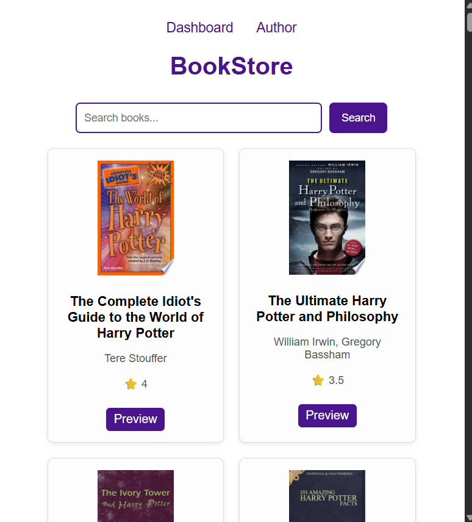

# Book Library Application

[](https://bookstoredigitalbevy.vercel.app/)

**Live Demo:** [https://bookstoredigitalbevy.vercel.app/](https://bookstoredigitalbevy.vercel.app/)

This is a full-stack Book Library app built for the Digital Bevy coding assignment.


## Tech Stack

- **Frontend:** React + Vite
- **Backend:** Node.js, Express
- **Database:** MongoDB Atlas
- **Deployment:**
  - Backend: Render
  - Frontend: Vercel

---

## Features

- Add, view, and delete books from the library
- Search books by title
- Backend with REST APIs
- MongoDB Atlas for persistent storage
- Simple author page with links to GitHub and LinkedIn

---

## Screenshots

### User Interface


### API Integration


### Database Collection


---

## Folder Structure

```
Bookstore/
├── booklibrary-backend/      # Node.js + Express backend
│   └── server.js
│   └── package.json
├── booklibrary-frontend/     # React + Vite frontend
│   └── src/
│   └── public/
│   └── package.json
│   └── vite.config.js
├── assests/                  # Screenshots
├── Readme.md
```

---

## Setup Instructions

### 1. Clone the repository
```bash
git clone https://github.com/MANASA-REDDY04/Bookstore.git
cd Bookstore
```

### 2. Backend Setup
```bash
cd booklibrary-backend
npm install
# Create a .env file with your MongoDB Atlas URI
echo MONGO_URI=your_mongodb_atlas_uri > .env
npm start
```

### 3. Frontend Setup
```bash
cd ../booklibrary-frontend
npm install
npm run dev
```

---

## Usage

1. Start the backend server (default: http://localhost:5000)
2. Start the frontend (default: http://localhost:5173)
3. Search for books, add them to your library, and view details.

---

## Author

- **Manasa Reddy Kandadi**
  - [GitHub](https://github.com/MANASA-REDDY04)
  - [LinkedIn](https://linkedin.com/in/kandadi-manasa)

---

## Credits

- [Google Books API](https://developers.google.com/books/docs/v1/getting_started)
- [Digital Bevy](https://digitalbevy.com/)

---

## License

This project is licensed under the MIT License.

- Add, view, and delete books from the library  
- Search books by title  
- Backend with REST APIs  
- MongoDB Atlas for persistent storage  
- Simple author page with links to GitHub and LinkedIn  

---

## Setup Instructions

### 1. Clone the repository
```bash
git clone https://github.com/MANASA-REDDY04/Bookstore.git
cd Bookstore
```
